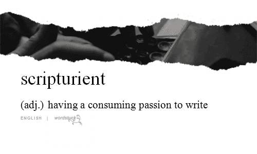

&nbsp;[](https://badge.fury.io/js/objectschema)&nbsp;[](https://gemnasium.com/xpepermint/objectschemajs)

# objectschema.js

> Schema enforced JavaScript objects.



## Install

```
$ npm install --save objectschema
```

## Example

```js
import {
  Document,
  Schema
} from 'objectschema';

let bookSchema = new Schema({
  fields: {
    title: {
      type: 'string'
    }
  }
});

let userSchema = new Schema({
  fields: {
    name: {
      type: 'string',
      validations: {
        presence: {
          message: 'is required'
        }
      }
    },
    books: {
      type: [bookSchema],
      validations: {
        presence: {
          message: 'is required'
        }
      }
    }
  }
});

let data = {
  name: 'John Smith',
  books: [
    {
      title: 'True Detective'
    }
  ]
};

let user = new Document(userSchema, data);
user.name; // -> 'John Smith'
await user.isValid(); // -> true
```

## API

This package consists of two core classes. The `Schema` class represents a configuration object and the `Document` represents a data object defined by the Schema.

This package also integrates [*typeable.js*](https://github.com/xpepermint/typeablejs) module for type casting and [*validatable.js*](https://github.com/xpepermint/validatablejs) for validating fields.

### Schema

Schema represents a configuration object which configures the `Document`. It holds information about fields, type casting, how fields are validated and what the default values are.

A Schema can also be used as a custom type object. This means that you can create a nested data structure by setting a schema instance for a field `type`.

**Schema({fields, mode, validator})**

> A class for defining document structure.

| Option | Type | Required | Default | Description
|--------|------|----------|---------|------------
| fields | Object | Yes | - | An object with fields definition.
| mode | String | No | strict | A schema type (use `relaxed` to allow dynamic fields not defined by the schema).
| validator | Object | No | validatable.js defaults | Configuration options for the Validator class, provided by the [validatable.js](https://github.com/xpepermint/validatablejs), which is used by this package for field validation.

```js

new Schema({
  fields: { // schema fields definition
    email: { // a field name holding a field definition
      type: 'string', // a field data type provided by typeable.js
      defaultValue: 'John Smith', // a default field value
      validations: { // field validations provided by validatable.js
        presence: { // validator name
          message: 'is required' // validator option
        }
      }
    },
  },
  mode: 'strict', // schema mode
  validator: {} // validatable.js configuration options (see the package's page for details)
});
```

This package uses [*typeable.js*](https://github.com/xpepermint/typeablejs) for data type casting. Many common data types and array types are supported. Please check package's website for a list of supported types and further information.

By default, all fields in a schema are set to `null`. We can set a default value for a field by setting the `defaultValue` option.

Field validation is handled by the [*validatable.js*](https://github.com/xpepermint/validatablejs) package. We can configure the validator by passing the `validator` option to the `Schema` class which will be passed directly to the `Validator` class. The package provides many built-in validators, allows adding custom validators and overridding existing ones. Please check package's website for details.

### Document

**Document(schema, data)**

> A class for creating schema-based objects.

| Option | Type | Required | Default | Description
|--------|------|----------|---------|------------
| schema | Schema | Yes | - | An instance of the Schema class.
| data | Object | No | - | Data object.

**document.populate(data)**:Document

> Applies data to a document.

| Option | Type | Required | Default | Description
|--------|------|----------|---------|------------
| data | Object | Yes | - | Data object.

**document.populateField(name, value)**:Any

> Sets a value of a document field.

| Option | Type | Required | Default | Description
|--------|------|----------|---------|------------
| name | string | Yes | - | Document field name.
| value | Any | Yes | - | Data object.

**document.clear()**:Document

> Sets all document fields to `null`.

**document.clearField(name)**:Document

> Sets a document field to `null`.

**document.clone()**:Document

> Returns a new Document instance which is the exact copy of the original instance.

**document.toObject()**:Object

> Converts a document into serialized data object.

**document.validate()**:Promise

> Validates all class fields and returns errors.

```js
{ // return value example
  name: { // field value is missing
    messages: ['is required'],
    isValid: false
  },
  book: { // nested object is missing
    messages: ['is required'],
    isValid: false
  },
  address: {
    messages: [],
    related: { // nested object errors
      post: {
        messages: ['is required'],
        isValid: false
      }
    },
    isValid: false
  },
  friends: { // an array of nested objects has errors
    messages: [],
    related: [
      undefined, // the first item was valid
      { // the second item has errors
        name: {
          messages: ['is required'],
          isValid: false
        }
      }
    ],
    isValid: false
  }
}
```

**document.validateField(name)**:Promise

> Validates a document field and returns errors.

| Option | Type | Required | Default | Description
|--------|------|----------|---------|------------
| name | string | Yes | - | Document field name.

**document.isValid()**:Promise

> Returns `true` when all document fields are valid.

**document.equalsTo(value)**:Boolean

> Returns `true` when the provided `value` represents an object with the same field values as the document.

**document.purge()**:Document

> Deletes all class fields.

**document.define()**:Document

> Defines class fields for all fields in schema.

## License (MIT)

```
Copyright (c) 2016 Kristijan Sedlak <xpepermint@gmail.com>

Permission is hereby granted, free of charge, to any person obtaining a copy
of this software and associated documentation files (the "Software"), to deal
in the Software without restriction, including without limitation the rights
to use, copy, modify, merge, publish, distribute, sublicense, and/or sell
copies of the Software, and to permit persons to whom the Software is
furnished to do so, subject to the following conditions:

The above copyright notice and this permission notice shall be included in
all copies or substantial portions of the Software.

THE SOFTWARE IS PROVIDED "AS IS", WITHOUT WARRANTY OF ANY KIND, EXPRESS OR
IMPLIED, INCLUDING BUT NOT LIMITED TO THE WARRANTIES OF MERCHANTABILITY,
FITNESS FOR A PARTICULAR PURPOSE AND NONINFRINGEMENT. IN NO EVENT SHALL THE
AUTHORS OR COPYRIGHT HOLDERS BE LIABLE FOR ANY CLAIM, DAMAGES OR OTHER
LIABILITY, WHETHER IN AN ACTION OF CONTRACT, TORT OR OTHERWISE, ARISING FROM,
OUT OF OR IN CONNECTION WITH THE SOFTWARE OR THE USE OR OTHER DEALINGS IN
THE SOFTWARE.
```
